# Examen Práctico Final — Seguridad Informática (Unidad IV)

**Estudiante:** Cristian Cabana Sulca
**Curso:** Seguridad Informática — Ciclo IX
**Unidad:** IV — Monitoreo de Seguridad, SIEM e Inteligencia Artificial

---

## 1. Entorno de trabajo

| Componente | Detalle |
|---|---|
| Sistema operativo | Ubuntu 22.04 LTS (máquina virtual) |
| Python | 3.12 (`python3 --version`) |
| Librerías usadas | `matplotlib`, `seaborn`, `pandas` |

### 1.1 Instalación de dependencias

El entorno Python de la VM está marcado como *externally-managed* (PEP 668), por lo que las librerías se instalaron vía `apt`:

```bash
sudo apt update
sudo apt install python3-pip -y
sudo apt install python3-matplotlib python3-seaborn python3-pandas -y
```

Verificación de instalación:
```bash
python3 -c "import matplotlib, seaborn, pandas; print('OK')"
```

---

## 2. Laboratorio 1 — Análisis Forense de Logs con Python

### 2.1 Contexto

Se analizan dos archivos de log ubicados en `lab1/`:

| Archivo | Descripción | Tamaño |
|---|---|---|
| `lab1/auth.log` | Log de autenticación SSH | 500 líneas |
| `lab1/access.log` | Log de acceso Apache (Combined Log Format) | 1000 líneas |

### 2.2 Scripts desarrollados

#### `lab1/analizar_ssh.py` — Tarea 1.1

- Parsea `auth.log` buscando líneas `Failed password` y extrae la IP de origen con una expresión regular.
- Cuenta intentos fallidos por IP y genera un ranking Top 10.
- Imprime en consola una alerta `[ALERTA]` para toda IP con más de 50 intentos fallidos (posible fuerza bruta).
- Exporta el resultado completo a `lab1/reporte_ssh.json`.

**Ejecución:**
```bash
python3 lab1/analizar_ssh.py
```

**Resultado obtenido (ejecución real):**
- Total de intentos fallidos: **253**
- IPs que dispararon alerta (> 50 intentos):
  - `45.33.32.156` → 120 intentos
  - `193.32.162.55` → 58 intentos

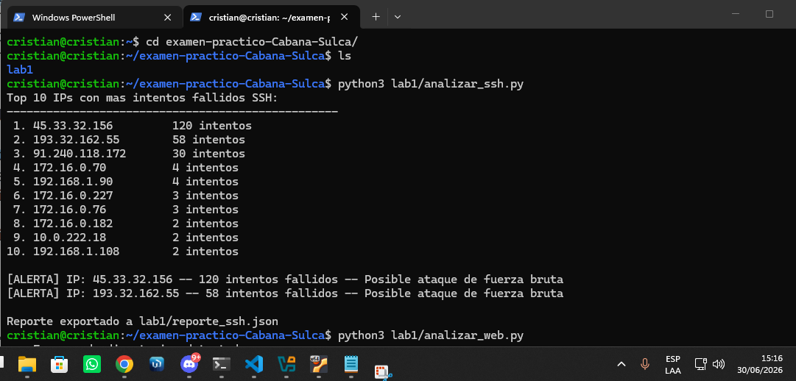
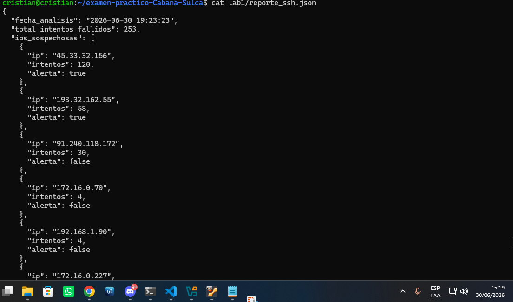

#### `lab1/analizar_web.py` — Tarea 1.2

- Parsea `access.log` en formato Combined Log Format de Apache con regex.
- Detecta **escaneo de directorios**: IPs con más de 20 rutas distintas solicitadas en una ventana deslizante de 60 segundos.
- Agrupa peticiones con código de respuesta **4xx/5xx** por IP.
- Detecta posibles **SQL Injection** buscando en la URL los patrones `UNION`, `SELECT`, `--`, `OR 1=1`, `'`.
- Exporta el resultado a `lab1/reporte_web.json`.

**Ejecución:**
```bash
python3 lab1/analizar_web.py
```

**Resultado obtenido (ejecución real):**
- Total de peticiones analizadas: **980**
- Escaneo de directorios detectado: 0 IPs (ninguna superó el umbral de 20 rutas/60s)
- IPs con errores 4xx/5xx: 30 IPs identificadas (ej. `45.33.32.156` con 47 errores: 34×404, 10×403, 3×500)
- Posibles intentos de SQL Injection detectados: **4**

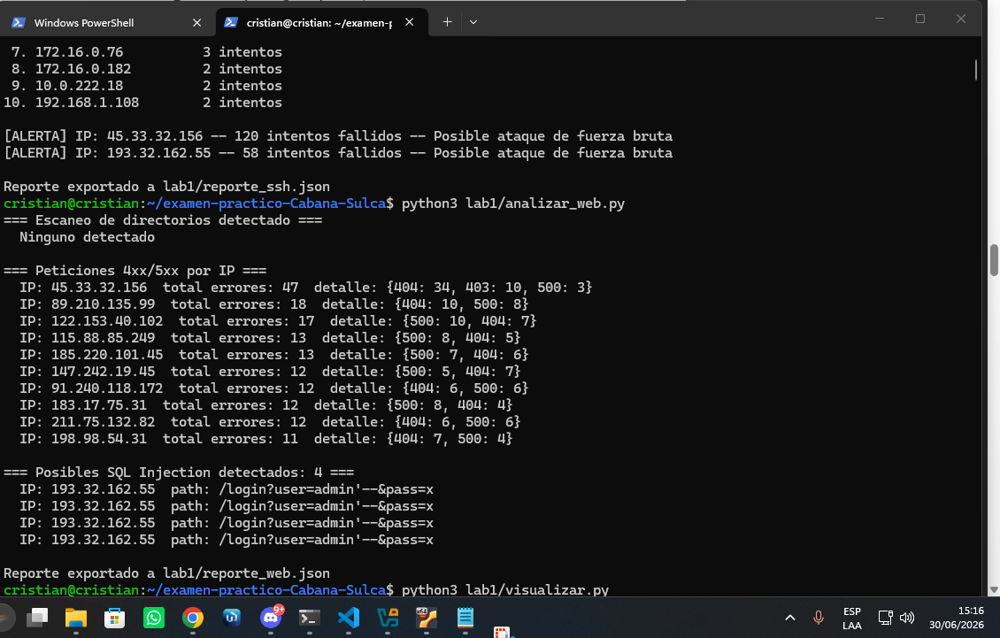
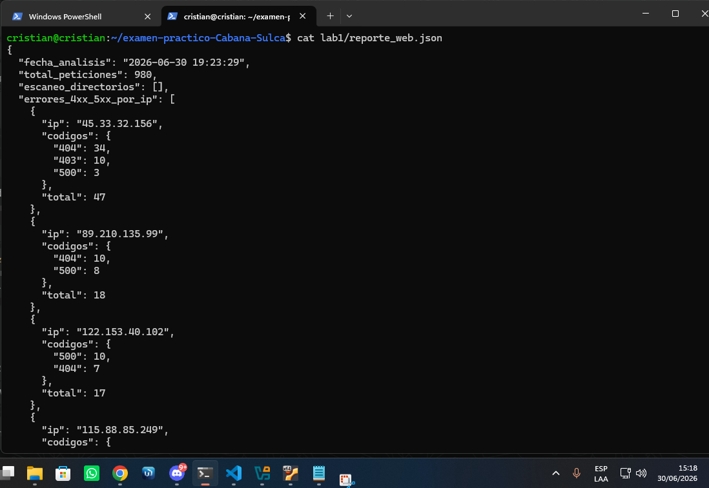

#### `lab1/visualizar.py` — Tarea 1.3

Genera 3 gráficas en `lab1/graficas/` usando `matplotlib`/`seaborn`, leyendo `reporte_ssh.json` y `access.log`.

**Ejecución (requiere haber corrido `analizar_ssh.py` primero):**
```bash
python3 lab1/analizar_ssh.py
python3 lab1/analizar_web.py
python3 lab1/visualizar.py
```

**Gráfico de barras — Top 10 IPs con más intentos fallidos SSH**

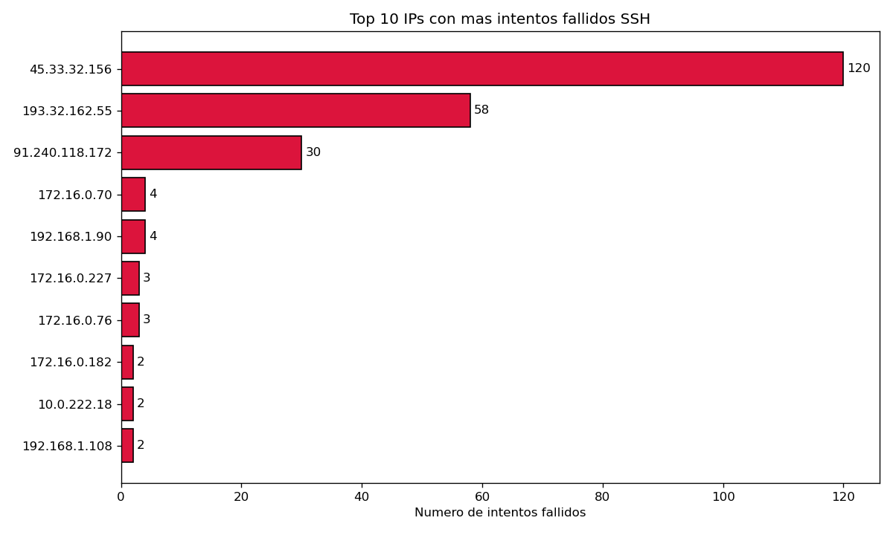

**Línea de tiempo — Peticiones HTTP por hora**

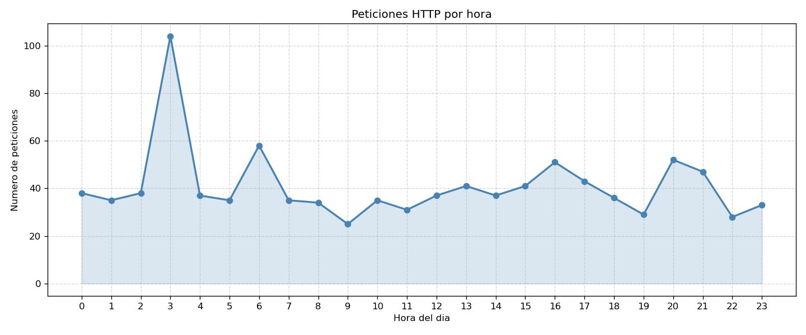

**Mapa de calor — Peticiones HTTP por hora y código de respuesta**

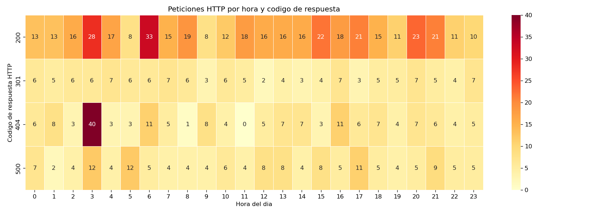

### 2.3 Estructura de entregables del Lab 1

```
lab1/
├── analizar_ssh.py
├── analizar_web.py
├── visualizar.py
├── auth.log
├── access.log
├── reporte_ssh.json          ← generado al ejecutar analizar_ssh.py
├── reporte_web.json          ← generado al ejecutar analizar_web.py
├── graficas/
│   ├── top10_ssh.png
│   ├── timeline_http.png
│   └── heatmap_http.png
└── evidencias/
    ├── SCR-1.1a_ssh_ejecucion.png
    ├── SCR-1.1b_ssh_json.png
    ├── SCR-1.2a_web_ejecucion.png
    └── SCR-1.2b_web_json.png
```

### 2.4 Cómo reproducir el Laboratorio 1

```bash
sudo apt install python3-matplotlib python3-seaborn python3-pandas -y
python3 lab1/analizar_ssh.py
python3 lab1/analizar_web.py
python3 lab1/visualizar.py
```

---

---

## 3. Laboratorio 2 — Reglas de Correlación en Wazuh

### 3.1 Contexto

Se crearon reglas de correlación personalizadas para Wazuh instalado en la máquina virtual. Las reglas se ubican en `/var/ossec/etc/rules/` y se activan sobre los logs del servicio SSH y del firewall.

| Componente | Detalle |
|---|---|
| Wazuh Manager | Instalado en Ubuntu 22.04 LTS |
| Directorio de reglas | `/var/ossec/etc/rules/` |
| Herramienta de validación | `xmllint` (`libxml2-utils`) |

Instalación de herramienta de validación:
```bash
sudo apt update && sudo apt install libxml2-utils -y
```

### 3.2 Reglas desarrolladas

#### `lab2/local_rules_ssh.xml` — Tarea 2.1: Brute Force SSH

Detecta ataques de fuerza bruta SSH correlacionando la regla nativa `5716` (Failed password) cuando se produce **10 o más veces en 60 segundos desde la misma IP**.

- Nivel de severidad: **10**
- Grupos: `authentication_failures`, `brute_force`
- Atributos clave: `frequency="10"`, `timeframe="60"`, `<same_source_ip />`

#### `lab2/local_rules_exfil.xml` — Tarea 2.2: Exfiltración de datos

Regla compuesta de dos pasos:

- **Regla 100010** (nivel 5): Detecta login SSH exitoso fuera del horario laboral (22:00 – 06:00) usando `<if_sid>5715</if_sid>` y `<time>22:00 - 06:00</time>`.
- **Regla 100011** (nivel 14 — crítico): Correlaciona la regla anterior con una transferencia de datos saliente superior a 500 MB (`bytes >= 500000000`) desde la misma IP dentro de una ventana de 3600 segundos.

### 3.3 Validación y activación de reglas

**Validar sintaxis XML:**
```bash
sudo xmllint --noout /var/ossec/etc/rules/local_rules_ssh.xml && echo "OK"
sudo xmllint --noout /var/ossec/etc/rules/local_rules_exfil.xml && echo "OK"
```

**Reiniciar el servicio Wazuh:**
```bash
sudo systemctl restart wazuh-manager
sudo systemctl status wazuh-manager
```

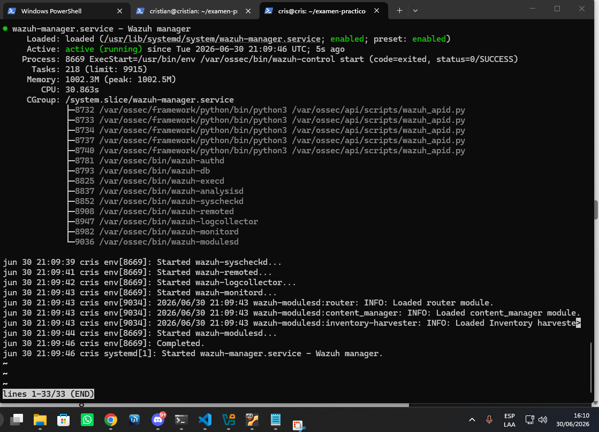

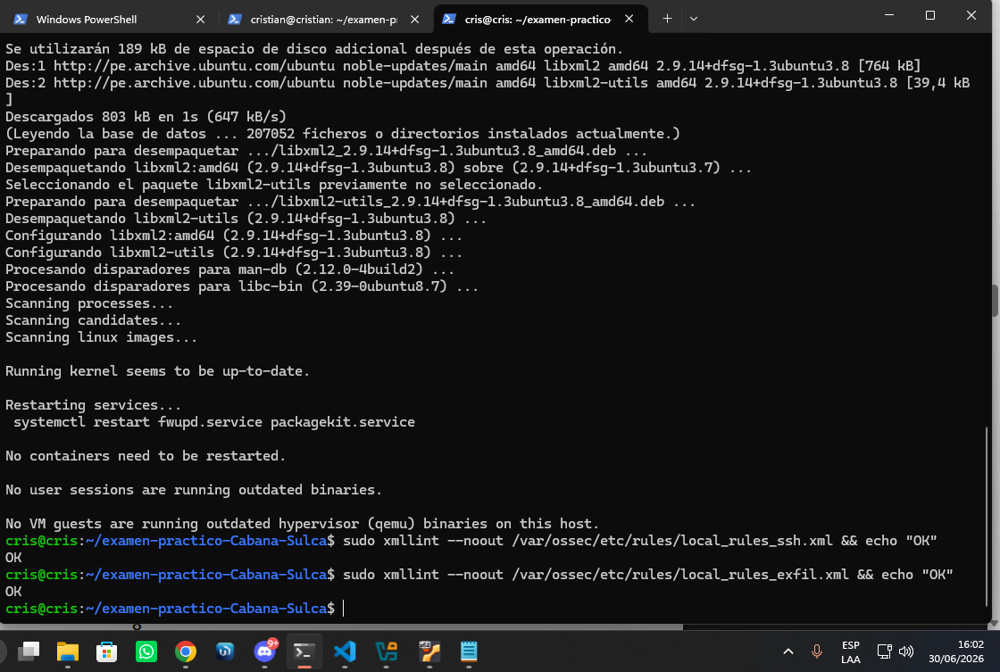

### 3.4 Simulación del ataque de fuerza bruta

Se desarrolló el script `lab2/simular_bruteforce.sh` que inyecta entradas de fallo SSH en el syslog del sistema mediante el comando `logger`. Wazuh monitorea `/var/log/auth.log` y aplica la regla `5716` sobre esas entradas, lo que acumula los eventos hasta disparar la regla personalizada `100001`.

**Ejecución:**
```bash
sudo bash lab2/simular_bruteforce.sh
```

El script envía 15 intentos fallidos desde la IP `45.33.32.156` con un intervalo de 0.4 segundos entre cada uno, superando el umbral de 10 intentos en 60 segundos configurado en la regla.

**Verificación de alerta en el log de Wazuh:**
```bash
sudo tail -50 /var/ossec/logs/alerts/alerts.log | grep -A8 "100001"
```

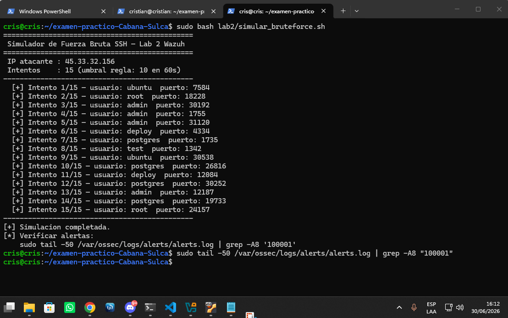

### 3.5 Estructura de entregables del Lab 2

```
lab2/
├── local_rules_ssh.xml
├── local_rules_exfil.xml
├── simular_bruteforce.sh
└── evidencias/
    ├── SCR-2.1_wazuh_activo.png
    ├── SCR-2.2_reglas_validadas.png
    └── SCR-2.3_alerta_disparada.png
```

---

---

## 4. Laboratorio 3 — Modelo de Detección de Anomalías con ML

### 4.1 Contexto

Se analizó el dataset `lab3/network_traffic.csv` con 10 000 registros de tráfico de red capturados durante 30 días. El objetivo fue entrenar un modelo no supervisado de detección de anomalías usando Isolation Forest.

| Componente | Detalle |
|---|---|
| Dataset | `network_traffic.csv` — 10 000 registros, 9 columnas |
| Modelo | Isolation Forest (`scikit-learn`) |
| Herramienta | Jupyter Notebook ejecutado con `nbconvert` |
| Librerías | `pandas`, `numpy`, `matplotlib`, `seaborn`, `scikit-learn`, `joblib` |

Instalación de dependencias adicionales:
```bash
pip3 install notebook nbconvert --break-system-packages
```

Ejecución del notebook sin interfaz gráfica:
```bash
python3 -m nbconvert --to notebook --execute lab3/deteccion_anomalias.ipynb --output deteccion_anomalias.ipynb --output-dir lab3/
```

### 4.2 Tarea 3.1 — Exploración y Preprocesamiento

- Se cargó el dataset con `pandas` y se mostraron estadísticas descriptivas (`df.describe()`).
- Se generaron histogramas de las columnas `bytes_sent` y `duration_sec` para visualizar su distribución.
- Se verificaron y eliminaron valores nulos con `df.dropna()`.
- Se aplicó **clipeo al percentil 99** en columnas numéricas para tratar outliers extremos.
- Se crearon 2 variables derivadas:
  - `ratio_bytes` = `bytes_sent / (bytes_recv + 1)` — indica si el host envía más de lo que recibe.
  - `bytes_por_segundo` = `bytes_sent / (duration_sec + 0.001)` — tasa de transferencia saliente.
- Se normalizaron las features con `StandardScaler`.

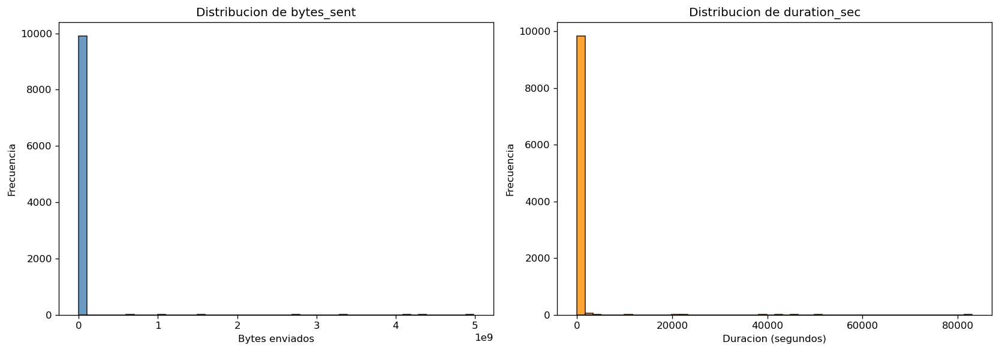

### 4.3 Tarea 3.2 — Entrenamiento del Modelo

Se entrenó un **Isolation Forest** con los siguientes parámetros (excluyendo la columna `label`):

```python
IsolationForest(contamination=0.05, n_estimators=100, random_state=42)
```

- Las predicciones devuelven `-1` para anomalías y `1` para tráfico normal.
- Se evaluó el modelo usando la columna `label` como ground truth (`anomaly` / `normal`).
- Métricas obtenidas: **Precision**, **Recall** y **F1-Score** calculados con `sklearn.metrics`.
- Se graficó la matriz de confusión con `seaborn`.

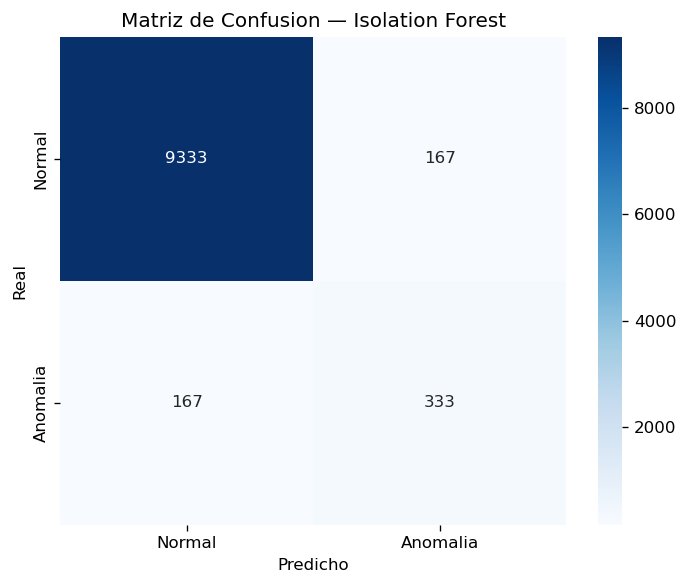

### 4.4 Tarea 3.3 — Interpretación y Umbral Dinámico

- Se graficó el **score de anomalía** (`decision_function`) para todos los registros ordenados de menor a mayor (valores más negativos = más anómalos).
- Se generó la **curva Umbral vs F1-Score** variando el umbral de decisión en 200 puntos entre el score mínimo y máximo, identificando el umbral óptimo que maximiza el F1.
- Se listaron los **Top 10 registros más anómalos** con todas sus columnas y se explicó en el notebook por qué representan amenazas reales (exfiltración de datos, ICMP tunneling, comunicación con C2, transferencias de alta tasa).

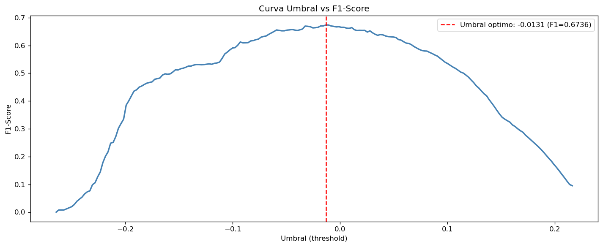

### 4.5 Tarea 3.4 — Exportación del Modelo

El modelo y el scaler se serializaron con `joblib`:

```python
joblib.dump(modelo, 'modelo_anomalias.pkl')
joblib.dump(scaler, 'scaler.pkl')
```

Se creó el script `lab3/predecir.py` que carga el modelo y clasifica un nuevo archivo CSV:

```bash
python3 lab3/predecir.py lab3/network_traffic.csv
```

Imprime en consola los registros detectados como anomalía con su score ordenado de más a menos anómalo.

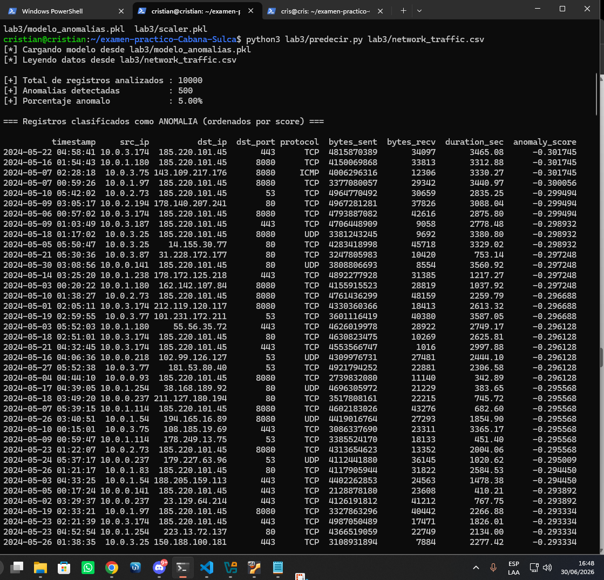

### 4.6 Estructura de entregables del Lab 3

```
lab3/
├── deteccion_anomalias.ipynb
├── predecir.py
├── network_traffic.csv
├── modelo_anomalias.pkl
├── scaler.pkl
└── evidencias/
    ├── SCR-3.1_eda.png
    ├── SCR-3.2_metricas.png
    ├── SCR-3.3_umbral_f1.png
    └── SCR-3.4_predecir.png
```
